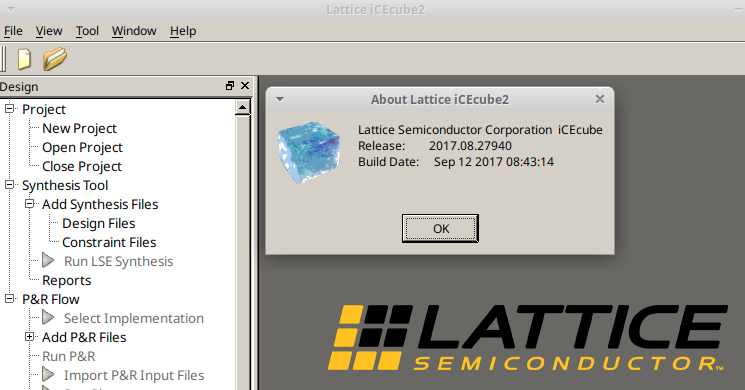

# Installing Lattice FPGA tools on Ubuntu

[Lattice Diamond](http://www.latticesemi.com/latticediamond) is provided as RPM packages as it is officially supported on RedHat systems only. However, we can use it on Ubuntu.

> Based on the excellent tutorial by Jacob Hipps https://ycnrg.org/lattice-diamond-on-ubuntu-16-04/

## Prerequisites

```bash
sudo apt-get install rpm rpm2cpio  
sudo pip install libusb1
```

## Step 1: Acquire the RPM

First, you'll need to sign up for an account on Lattice's website, then you'll be able to download the software [here](http://www.latticesemi.com/view_document?document_id=52032). Create a directory called `diamond`, then download the RPM to this directory.

```bash
mkdir diamond
```

## Step 2: Extract the RPM, Install Files

In the `diamond` directory, run the following command to extract the file contents:  

```
rpm2cpio *.rpm | cpio -idmv  
```

Next, we will need the post-install scriptlet from the RPM.  

```
rpm -qp --scripts *.rpm  
```

This command will print *all* of the scriptlets. Highlight and copy the postinstall section, then open a text editor and paste the  contents into a file named **postin.sh**. Once that's done, make the file executable, and run it:  

```
chmod +x postin.sh  
RPM_INSTALL_PREFIX=$PWD/usr/local bash postin.sh  
```

Now, copy the files to the correct location:  

```
sudo cp -Rva --no-preserve=ownership ./usr/local/diamond /usr/local/  
```

The *diamond* directory we created for the intermediate steps can be removed once installation is complete (optional):  

```
cd ../  
rm -Rf diamond  
```

## Step 3: Setup udev rules

If you will be using a dev board or programming cable with Diamond,  you will need to set up some udev rules to ensure the kernel's ftdi_sio  driver doesn't bind to the device. We will also need to ensure correct  permissions on the devices **(NOTE: If Diamond or Programmer start with your device plugged in, but are unable to access the device due to permissions issues, they will segfault! Yay...)**.

Create a file called `/etc/udev/rules.d/10-lattice.rules` with the following contents (adjust as necessary). You'll need to be root, or use `sudo` to create this file:  

```
ATTRS{idVendor}=="0403", ATTRS{idProduct}=="6010", MODE="0666", SYMLINK+="ftdi-%n", RUN+="/bin/sh -c 'basename $(dirname $(realpath /sys%p/device)) > /sys/bus/usb/drivers/ftdi_sio/unbind'",RUN+="/root/ftdi_fixer.py"  
```

The vendor and product ID can be determined by running `lsusb` with your device plugged in to your machine.

The above entry runs a couple of commands whenever your device is  plugged in. The first is to unbind the device from the ftdi_sio kernel  driver. The second is a Python script (introduced shortly), which will  properly fix the device entry permissions, since udev fails to do this  correctly (it is likely I am doing something wrong, but at least this  works).

The script `/root/ftdi_fixer.py` can be viewed [here](https://ycc.io/scripts/ftdi_fixer.py). This is a short script I wrote (which utilizes libusb1 we installed earlier) to fix the device entry permissions.

```
sudo curl https://ycc.io/scripts/ftdi_fixer.py -o/root/ftdi_fixer.py  
sudo chmod +x /root/ftdi_fixer.py  
```

Now that everything is in place, be sure to unplug your cable (if it's plugged in), then reload the udev rules:

```
sudo udevadm control --reload  
```

Now plugging in your cable, you should see entries like the following in syslog or dmesg:  

```
[3117880.476085] ftdi_sio ttyUSB1: FTDI USB Serial Device converter now disconnected from ttyUSB1
[3117880.476109] ftdi_sio 3-14:1.1: device disconnected
[3117881.483165] ftdi_sio ttyUSB0: FTDI USB Serial Device converter now disconnected from ttyUSB0
[3117881.483193] ftdi_sio 3-14:1.0: device disconnected
```

This means that the device was disconnected *from the driver* (which is what we want). Be sure to check `/var/log/syslog` for execution errors for the ftdi_fixer.py script if you encounter problems.

## Conclusion

Now that the device is connected and ready-to-go, you should be able  to access the adapter from within Lattice Diamond or Lattice Programmer  (formerly called ispVM).



